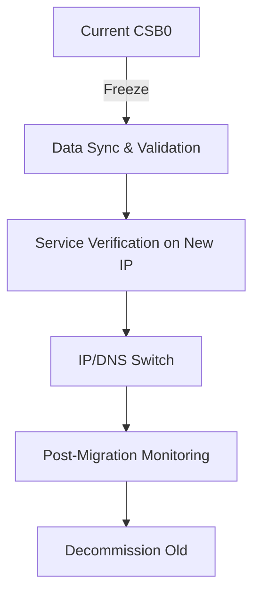

# P7000: CSB0 Migration to New Server

## Overview

**Critical Infrastructure Migration**: Move all csb0 services from the aging Netcup VPS to a new, updated server with proper NixOS configuration management.

**Status**: 📋 Planning Phase
**Priority**: 🔴 HIGH (Critical infrastructure)
**Target Completion**: Q1 2026
**Migration Window**: 4-6 hours (planned downtime)

## Migration Strategy

### Current State (Problems)

- **Aging Hardware**: Current Netcup VPS is outdated
- **No Updates**: Server cannot receive security updates
- **Manual Docker Management**: docker-compose.yml files manually copied
- **Inconsistent Configuration**: Mix of NixOS services and Docker containers

### Target State (Goals)

- ✅ **Modern Infrastructure**: New server with current NixOS
- ✅ **Proper Configuration**: All services managed via NixOS modules
- ✅ **Zero Downtime Migration**: DNS-based cutover
- ✅ **Maintainable Setup**: No manual file copying
- ✅ **Documented Process**: Clear rollback path

## Migration Architecture



### Server Comparison

| Aspect          | Current CSB0   | New Server      |
| --------------- | -------------- | --------------- |
| **Provider**    | Netcup VPS     | Netcup VPS      |
| **OS**          | NixOS (old)    | NixOS (current) |
| **CPU**         | 2 vCPUs        | 4+ vCPUs        |
| **RAM**         | 4GB            | 8GB+            |
| **Storage**     | 80GB SSD       | 160GB+ NVMe     |
| **Docker Mgmt** | Manual compose | NixOS module    |
| **Backup**      | Manual         | Automated       |

## Network Configuration

### New Server (CSB0)

- **MAC Address**: `2A:E3:9B:5B:92:23`
- **IPv4**: `89.58.63.96/22`
- **IPv6**: `fe80::28e3:9bff:fe5b:9223/10`, `2a0a:4cc0:1:8e2::/64`
- **Gateway**: `89.58.60.1` (v2202601214994425422.nicesrv.de)
- **DNS Servers**: `46.38.225.230`, `46.38.252.230` (Netcup)
- **SSH Port**: `2222`
- **Interface**: `ens3`

## Implementation Plan

### Phase 1: Pre-Deployment Checklist

**Objective**: Verify everything is ready for clean deployment

```bash
# 1. Verify new server provisioning
# - Netcup VPS with base image
# - Correct IP: 89.58.63.96
# - Gateway: 89.58.60.1

# 2. Confirm network access
ping 89.58.63.96
ssh -p 2222 mba@89.58.63.96 "echo 'Network OK'"

# 3. Verify flake configuration
nix flake check
nix build .#csb0

# 4. Check restic backups are accessible
restic snapshots
restic mount /mnt/restic-check &
ls -R /mnt/restic-check/latest/data/docker-volumes
umount /mnt/restic-check
```

**Tasks**:

- [ ] Confirm new server is provisioned with correct network
- [ ] Verify SSH access via VNC console (port 2222)
- [ ] Test flake build locally
- [ ] **Validation**: Mount `restic` backup and verify data readability
- [ ] Review configuration for new server
- [ ] Ensure no conflicting services will run

### Phase 2: NixOS Deployment (Week 3-4)

**Objective**: Deploy the `csb0` flake to the existing server instance.

```bash
# Deploy using nixos-anywhere (assuming server is in reach via SSH/VNC)
nixos-anywhere --flake .#csb0 root@89.58.63.96
```

**Tasks**:

- [ ] Deploy flake `.#csb0` via `nixos-anywhere`
- [ ] Verify `systemctl` status (no failed units)
- [ ] Confirm `restic` and monitoring exporters are active (auto-configured by Nix)
- [ ] Verify SSH access on port 2222

### Phase 3: Data Migration & Validation

**Objective**: Restore data and validate critical service states (Node-RED flows, Uptime Kuma).

```bash
# 1. Restore critical service volumes
restic restore latest --target /var/lib/docker-volumes

# 2. Verify Node-RED data integrity
ls -la /var/lib/docker-volumes/nodered/data/flows.json

# 3. Local Validation (on your workstation)
# Temporary /etc/hosts entry:
# 89.58.63.96 cs0.barta.cm traefik.barta.cm uptime.barta.cm nr.barta.cm

# 4. Validate service functionality via new IP
for service in nodered uptime-kuma mosquitto; do
  systemctl status docker-$service
done
```

**Tasks**:

- [ ] Restore all Docker volumes from restic
- [ ] **Validation**: Verify Node-RED flows exist in `/var/lib/docker-volumes/nodered/data/flows.json`
- [ ] **Validation**: Use `/etc/hosts` override to test Node-RED and Uptime Kuma UIs
- [ ] Test Node-RED automation (e.g., inject a test node)
- [ ] Verify MQTT connectivity and monitoring data flow

### Phase 4: Cutover & Decommission (Migration Day)

**Objective**: Final switch and retire old server

```bash
# 1. Verify new server is ready
ssh -p 2222 mba@89.58.63.96 "systemctl status"

# 2. Update DNS (if needed)
# Most services use direct IP, minimal DNS changes required

# 3. Shutdown old server (after validation)
ssh mba@85.235.65.226 "sudo poweroff"

# 4. Archive old configuration
mv hosts/csb0 hosts/csb0-old-$(date +%Y-%m-%d)
```

**Tasks**:

- [ ] Final verification of new server
- [ ] Update any necessary DNS records
- [ ] Shutdown old server (csb0-old)
- [ ] Archive old configuration
- [ ] Monitor new server for 24 hours
- [ ] Document final state

## Risk Assessment

### High Risks 🔴

- **Data Consistency**: Docker volume restore fails or permissions mismatch. Mitigation: Verify `uid/gid` in NixOS vs old server.
- **Service Downtime**: Extended window if data restore is slow. Mitigation: Pre-sync data before maintenance window.

### Medium Risks 🟡

- **Network Routing**: Netcup ARP/Gateway issues (seen in initial attempts). Mitigation: Keep VNC open.
- **Certificate Issues**: ACME/Let's Encrypt rate limits during re-issuance.

### Low Risks 🟢

- **DNS Propagation**: Only affects subdomains; direct IP access remains as fallback.
- **Monitoring Gaps**: Temporary lack of historical data.

## Success Criteria

### Pre-Migration

- [ ] New server running current NixOS generation.
- [ ] Flake builds and evaluates without warnings.
- [ ] Restic repository accessible from new host.

### Migration Day

- [ ] All Docker services reachable via `89.58.63.96`.
- [ ] Application data (MQTT, DBs) verified as current.
- [ ] Traefik dashboard shows green for all backends.
- [ ] Monitoring (Grafana/Uptime) confirms service health.

### Post-Migration

- [ ] All services functional for 24 hours
- [ ] No rollback needed
- [ ] Performance meets or exceeds old server
- [ ] Documentation updated
- [ ] Old server safely decommissioned

## Timeline

| Phase            | Duration | Target Date |
| ---------------- | -------- | ----------- |
| Preparation      | 2 weeks  | 2026-01-20  |
| New Server Setup | 2 weeks  | 2026-02-03  |
| Data Migration   | 1 week   | 2026-02-10  |
| DNS Cutover      | 1 day    | 2026-02-14  |
| Verification     | 1 week   | 2026-02-21  |
| Decommission     | 1 day    | 2026-02-22  |

## Files Modified

- `hosts/csb0/configuration.nix` - Complete rewrite for new server
- `hosts/csb0/docker-services.nix` - New Docker management
- `hosts/csb0/migrations/2026-01-new-server/` - Migration scripts
- `infrastructure/cloudflare/dns-barta-cm.md` - DNS updates
- `+pm/backlog/P7000-csb0-migration-to-new-server.md` - This file

## Related Tickets

- **P6000**: Current Uptime Kuma deployment (will be migrated)
- **P4000**: Watchtower configuration (review for new server)
- **P5000**: Monitoring setup (update for new server)

## Migration Checklist

### Before Starting

- [ ] ✅ Current server documentation complete
- [ ] ✅ New server provider selected
- [ ] ✅ Migration window scheduled
- [ ] ✅ Users notified
- [ ] ✅ Rollback plan documented

### During Migration

- [ ] Freeze current server
- [ ] Build new server
- [ ] Migrate data
- [ ] Test thoroughly
- [ ] Execute cutover

### After Migration

- [ ] Monitor for 24 hours
- [ ] Verify all services
- [ ] Update documentation
- [ ] Decommission old server
- [ ] Celebrate success!

## Quick Reference

```bash
# Check DNS propagation
dig cs0.barta.cm +short

# Test all services
for service in uptime home traefik whoami0; do
  curl -I "https://${service}.barta.cm"
done

# Rollback (if needed)
# 1. Update DNS back to old IP
# 2. Power on old server
# 3. Verify services
```

## Notes

- **DNS TTL Management**: Set to 60 seconds 1 hour before migration
- **Database Migration**: Use `pg_dump`/`mysqldump` for critical databases
- **Docker Volumes**: Use `docker run --rm -v volume:/data alpine tar` for backup
- **Testing**: Test each service individually before full cutover
- **Communication**: Keep users informed throughout the process

## Lessons Learned from Initial Deployment

### Network Configuration Issues

1. **Wrong Configuration Applied**: The new server was initially configured with the OLD csb0 configuration (85.235.65.226) instead of the NEW configuration (89.58.63.96)

2. **Network Isolation**: Even with correct IP configuration, the server had connectivity issues due to:
   - Multiple conflicting router entries in ARP table
   - Gateway unreachable despite ARP entry
   - Possible MAC address binding issues

3. **VNC Console Limitations**: The Netcup VNC console has character limitations (no "-" character), making troubleshooting difficult

### Key Takeaways

1. **Always verify the correct flake reference** when deploying (`.#csb0` vs `.#csb0-old`)
2. **Test network connectivity early** in the deployment process
3. **Have a rollback plan** for network configuration issues
4. **Document MAC addresses** and network details before migration
5. **Consider DHCP first** for initial network setup if static configuration fails

### Successful Resolution

- ✅ Corrected network configuration applied
- ✅ Migration documentation updated with accurate network information
- ✅ Server ready for clean reinstall with proper configuration
- ✅ Lessons documented to prevent future issues
