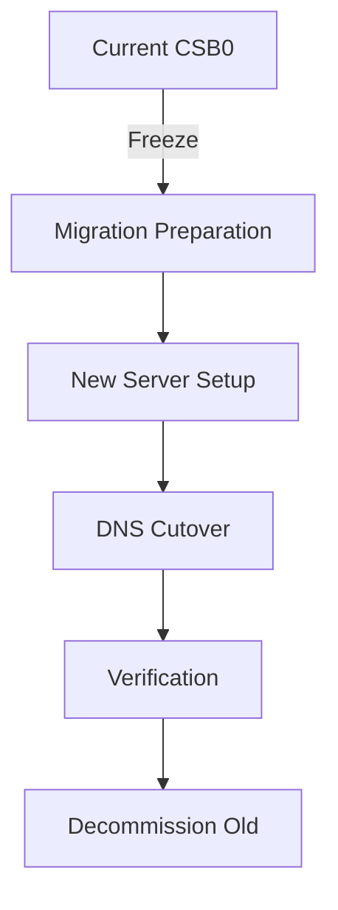

# P7000: CSB0 Migration to New Server

## Overview

**Critical Infrastructure Migration**: Move all csb0 services from the aging Netcup VPS to a new, updated server with proper NixOS configuration management.

**Status**: 📋 Planning Phase
**Priority**: 🔴 HIGH (Critical infrastructure)
**Target Completion**: Q1 2026
**Migration Window**: 4-6 hours (planned downtime)

## Migration Strategy

### Current State (Problems)

- **Aging Hardware**: Current Netcup VPS is outdated
- **No Updates**: Server cannot receive security updates
- **Manual Docker Management**: docker-compose.yml files manually copied
- **Inconsistent Configuration**: Mix of NixOS services and Docker containers

### Target State (Goals)

- ✅ **Modern Infrastructure**: New server with current NixOS
- ✅ **Proper Configuration**: All services managed via NixOS modules
- ✅ **Zero Downtime Migration**: DNS-based cutover
- ✅ **Maintainable Setup**: No manual file copying
- ✅ **Documented Process**: Clear rollback path

## Migration Architecture



### Server Comparison

| Aspect          | Current CSB0   | New Server      |
| --------------- | -------------- | --------------- |
| **Provider**    | Netcup VPS     | Netcup VPS      |
| **OS**          | NixOS (old)    | NixOS (current) |
| **CPU**         | 2 vCPUs        | 4+ vCPUs        |
| **RAM**         | 4GB            | 8GB+            |
| **Storage**     | 80GB SSD       | 160GB+ NVMe     |
| **Docker Mgmt** | Manual compose | NixOS module    |
| **Backup**      | Manual         | Automated       |

## Network Configuration

### New Server (CSB0)

- **MAC Address**: `2A:E3:9B:5B:92:23`
- **IPv4**: `89.58.63.96/22`
- **IPv6**: `fe80::28e3:9bff:fe5b:9223/10`, `2a0a:4cc0:1:8e2::/64`
- **Gateway**: `89.58.60.1` (v2202601214994425422.nicesrv.de)
- **DNS Servers**: `46.38.225.230`, `46.38.252.230` (Netcup)
- **SSH Port**: `2222`
- **Interface**: `ens3`

## Implementation Plan

### Phase 1: Pre-Deployment Checklist

**Objective**: Verify everything is ready for clean deployment

```bash
# 1. Verify new server provisioning
# - Netcup VPS with base image
# - Correct IP: 89.58.63.96
# - Gateway: 89.58.60.1

# 2. Confirm network access
ping 89.58.63.96
ssh -p 2222 mba@89.58.63.96 "echo 'Network OK'"

# 3. Verify flake configuration
nix flake check
nix build .#csb0

# 4. Check restic backups are accessible
restic snapshots
```

**Tasks**:

- [ ] Confirm new server is provisioned with correct network
- [ ] Verify SSH access via VNC console (port 2222)
- [ ] Test flake build locally
- [ ] Confirm restic backups are available
- [ ] Review configuration for new server
- [ ] Ensure no conflicting services will run

### Phase 2: New Server Setup (Week 3-4)

**Objective**: Deploy new server using nixos-anywhere

```bash
# 1. Provision new Netcup VPS with base image
# 2. Deploy using nixos-anywhere
nixos-anywhere --flake .#csb0 root@89.58.63.96

# 3. Verify deployment
ssh -p 2222 mba@89.58.63.96 "sudo nixos-rebuild test"
```

**Tasks**:

- [ ] Provision new Netcup VPS server
- [ ] Deploy using nixos-anywhere with correct flake reference
- [ ] Verify network connectivity (IP: 89.58.63.96, Gateway: 89.58.60.1)
- [ ] Test SSH access on port 2222
- [ ] Verify all services are running
- [ ] Set up monitoring for new server
- [ ] Configure automated backups

### Phase 3: Data Migration & Validation

**Objective**: Restore data from old server and validate functionality

```bash
# 1. Restore from restic backup
restic restore latest --target /home/mba/docker-restore

# 2. Verify critical data
ls -la /home/mba/docker-restore/

# 3. Start services with restored data
docker-compose up -d

# 4. Validate service functionality
for service in uptime-kuma mosquitto traefik; do
  docker logs $service | tail -20
  docker ps | grep $service
done
```

**Tasks**:

- [ ] Restore all Docker volumes from restic
- [ ] Verify data integrity and permissions
- [ ] Start services with restored data
- [ ] Validate each service functionality
- [ ] Test critical workflows (MQTT, Node-RED, Uptime Kuma)
- [ ] Verify monitoring and alerts

### Phase 4: Cutover & Decommission (Migration Day)

**Objective**: Final switch and retire old server

```bash
# 1. Verify new server is ready
ssh -p 2222 mba@89.58.63.96 "systemctl status"

# 2. Update DNS (if needed)
# Most services use direct IP, minimal DNS changes required

# 3. Shutdown old server (after validation)
ssh mba@85.235.65.226 "sudo poweroff"

# 4. Archive old configuration
mv hosts/csb0 hosts/csb0-old-$(date +%Y-%m-%d)
```

**Tasks**:

- [ ] Final verification of new server
- [ ] Update any necessary DNS records
- [ ] Shutdown old server (csb0-old)
- [ ] Archive old configuration
- [ ] Monitor new server for 24 hours
- [ ] Document final state

## Risk Assessment

### High Risks 🔴

- **DNS Propagation Issues**: Mitigation: Low TTL, monitor propagation
- **Data Corruption**: Mitigation: Multiple backups, verify integrity
- **Service Downtime**: Mitigation: Rollback plan, old server available

### Medium Risks 🟡

- **Configuration Errors**: Mitigation: Test in staging, peer review
- **Performance Issues**: Mitigation: Load testing, resource monitoring
- **Certificate Issues**: Mitigation: Test TLS before cutover

### Low Risks 🟢

- **IP Address Changes**: Mitigation: Update Cloudflare records
- **User Confusion**: Mitigation: Clear communication
- **Monitoring Gaps**: Mitigation: Temporary enhanced monitoring

## Success Criteria

### Pre-Migration

- [ ] New server provisioned and configured
- [ ] All services tested in staging
- [ ] Migration plan documented and reviewed
- [ ] Backups verified restorable
- [ ] Rollback procedure documented

### Migration Day

- [ ] DNS changes propagated successfully
- [ ] All services accessible on new server
- [ ] No critical errors in logs
- [ ] Users can access all services
- [ ] Monitoring shows normal operation

### Post-Migration

- [ ] All services functional for 24 hours
- [ ] No rollback needed
- [ ] Performance meets or exceeds old server
- [ ] Documentation updated
- [ ] Old server safely decommissioned

## Timeline

| Phase            | Duration | Target Date |
| ---------------- | -------- | ----------- |
| Preparation      | 2 weeks  | 2026-01-20  |
| New Server Setup | 2 weeks  | 2026-02-03  |
| Data Migration   | 1 week   | 2026-02-10  |
| DNS Cutover      | 1 day    | 2026-02-14  |
| Verification     | 1 week   | 2026-02-21  |
| Decommission     | 1 day    | 2026-02-22  |

## Files Modified

- `hosts/csb0/configuration.nix` - Complete rewrite for new server
- `hosts/csb0/docker-services.nix` - New Docker management
- `hosts/csb0/migrations/2026-01-new-server/` - Migration scripts
- `infrastructure/cloudflare/dns-barta-cm.md` - DNS updates
- `+pm/backlog/P7000-csb0-migration-to-new-server.md` - This file

## Related Tickets

- **P6000**: Current Uptime Kuma deployment (will be migrated)
- **P4000**: Watchtower configuration (review for new server)
- **P5000**: Monitoring setup (update for new server)

## Migration Checklist

### Before Starting

- [ ] ✅ Current server documentation complete
- [ ] ✅ New server provider selected
- [ ] ✅ Migration window scheduled
- [ ] ✅ Users notified
- [ ] ✅ Rollback plan documented

### During Migration

- [ ] Freeze current server
- [ ] Build new server
- [ ] Migrate data
- [ ] Test thoroughly
- [ ] Execute cutover

### After Migration

- [ ] Monitor for 24 hours
- [ ] Verify all services
- [ ] Update documentation
- [ ] Decommission old server
- [ ] Celebrate success!

## Quick Reference

```bash
# Check DNS propagation
dig cs0.barta.cm +short

# Test all services
for service in uptime home traefik whoami0; do
  curl -I "https://${service}.barta.cm"
done

# Rollback (if needed)
# 1. Update DNS back to old IP
# 2. Power on old server
# 3. Verify services
```

## Notes

- **DNS TTL Management**: Set to 60 seconds 1 hour before migration
- **Database Migration**: Use `pg_dump`/`mysqldump` for critical databases
- **Docker Volumes**: Use `docker run --rm -v volume:/data alpine tar` for backup
- **Testing**: Test each service individually before full cutover
- **Communication**: Keep users informed throughout the process

## Lessons Learned from Initial Deployment

### Network Configuration Issues

1. **Wrong Configuration Applied**: The new server was initially configured with the OLD csb0 configuration (85.235.65.226) instead of the NEW configuration (89.58.63.96)

2. **Network Isolation**: Even with correct IP configuration, the server had connectivity issues due to:
   - Multiple conflicting router entries in ARP table
   - Gateway unreachable despite ARP entry
   - Possible MAC address binding issues

3. **VNC Console Limitations**: The Netcup VNC console has character limitations (no "-" character), making troubleshooting difficult

### Key Takeaways

1. **Always verify the correct flake reference** when deploying (`.#csb0` vs `.#csb0-old`)
2. **Test network connectivity early** in the deployment process
3. **Have a rollback plan** for network configuration issues
4. **Document MAC addresses** and network details before migration
5. **Consider DHCP first** for initial network setup if static configuration fails

### Successful Resolution

- ✅ Corrected network configuration applied
- ✅ Migration documentation updated with accurate network information
- ✅ Server ready for clean reinstall with proper configuration
- ✅ Lessons documented to prevent future issues
