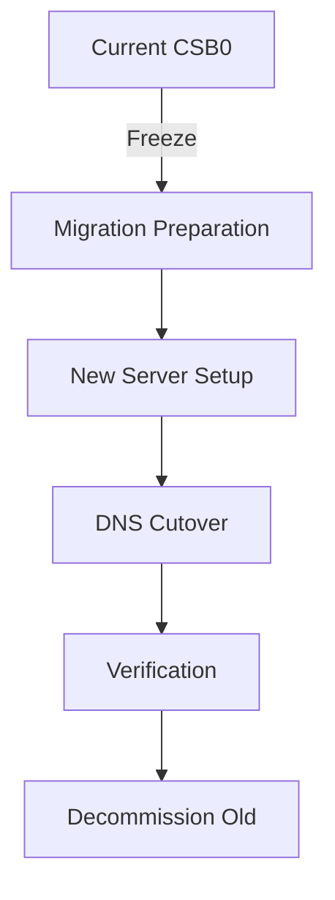

# P7000: CSB0 Migration to New Server

## Overview

**Critical Infrastructure Migration**: Move all csb0 services from the aging Netcup VPS to a new, updated server with proper NixOS configuration management.

**Status**: 📋 Planning Phase
**Priority**: 🔴 HIGH (Critical infrastructure)
**Target Completion**: Q1 2026
**Migration Window**: 4-6 hours (planned downtime)

## Migration Strategy

### Current State (Problems)

- **Aging Hardware**: Current Netcup VPS is outdated
- **No Updates**: Server cannot receive security updates
- **Manual Docker Management**: docker-compose.yml files manually copied
- **Inconsistent Configuration**: Mix of NixOS services and Docker containers

### Target State (Goals)

- ✅ **Modern Infrastructure**: New server with current NixOS
- ✅ **Proper Configuration**: All services managed via NixOS modules
- ✅ **Zero Downtime Migration**: DNS-based cutover
- ✅ **Maintainable Setup**: No manual file copying
- ✅ **Documented Process**: Clear rollback path

## Migration Architecture



### Server Comparison

| Aspect          | Current CSB0   | New Server      |
| --------------- | -------------- | --------------- |
| **Provider**    | Netcup VPS     | Netcup VPS      |
| **OS**          | NixOS (old)    | NixOS (current) |
| **CPU**         | 2 vCPUs        | 4+ vCPUs        |
| **RAM**         | 4GB            | 8GB+            |
| **Storage**     | 80GB SSD       | 160GB+ NVMe     |
| **Docker Mgmt** | Manual compose | NixOS module    |
| **Backup**      | Manual         | Automated       |

## Network Configuration

### New Server (CSB0)

- **MAC Address**: `2A:E3:9B:5B:92:23`
- **IPv4**: `89.58.63.96/22`
- **IPv6**: `fe80::28e3:9bff:fe5b:9223/10`, `2a0a:4cc0:1:8e2::/64`
- **Gateway**: `89.58.60.1` (v2202601214994425422.nicesrv.de)
- **DNS Servers**: `46.38.225.230`, `46.38.252.230` (Netcup)
- **SSH Port**: `2222`
- **Interface**: `ens3`

## Implementation Plan

### Phase 1: Preparation & Freeze (Week 1-2)

**Objective**: Stabilize current environment and prepare for migration

```bash
# 1. Document current state
nixos-generate-config --show-hardware-config > hardware-configuration.nix
systemctl list-units --type=service --state=running

# 2. Create comprehensive backups
restic backup /home/mba/docker
restic backup /var/lib/docker/volumes

# 3. Freeze updates
sudo nix-channel --remove nixos
sudo nix-channel --add https://nixos.org/channels/nixos-23.11 nixos
sudo nix-channel --update
```

**Tasks**:

- [ ] Create `hosts/csb0/migrations/2026-01-new-server/` directory
- [ ] Document all running services and versions
- [ ] Backup all Docker volumes and configurations
- [ ] Test backup restoration procedure
- [ ] Set update freeze in Nix configuration
- [ ] Notify users of upcoming migration

### Phase 2: New Server Setup (Week 3-4)

**Objective**: Build new server with proper NixOS configuration

```nix
# New configuration structure
{
  # Proper Docker Compose integration
  services.docker-compose = {
    enable = true;
    files = [
      {
        name = "csb0-services";
        file = ./docker-services.nix;  # Generated from Nix
      }
    ];
  };

  # Individual service configurations
  services.uptime-kuma = {
    enable = true;
    package = pkgs.uptime-kuma;
    # ... config ...
  };
}
```

**Tasks**:

- [ ] Provision new server (Hetzner/Netcup)
- [ ] Set up NixOS with current channel
- [ ] Implement Docker Compose via NixOS module
- [ ] Migrate all services to proper Nix configurations
- [ ] Test each service individually
- [ ] Set up monitoring for new server
- [ ] Configure automated backups

### Phase 3: Data Migration (Week 5)

**Objective**: Migrate all data from old to new server

```bash
# 1. Database migration (example for Uptime Kuma)
cd ~/docker/uptime-kuma
tar czvf uptime-kuma-data.tar.gz data/
scp -P 2222 uptime-kuma-data.tar.gz mba@new-server:/tmp/

# 2. Docker volume migration
docker run --rm -v uptime-kuma_data:/data -v /backup:/backup alpine
  tar czvf /backup/uptime-kuma-data.tar.gz -C /data .

# 3. Verify data integrity
ssh mba@new-server "cd /tmp && tar xzvf uptime-kuma-data.tar.gz"
```

**Tasks**:

- [ ] Migrate all Docker volumes
- [ ] Migrate database data
- [ ] Migrate configuration files
- [ ] Verify data integrity
- [ ] Test service functionality with migrated data
- [ ] Set up final backups before cutover

### Phase 4: DNS Cutover (Migration Day)

**Objective**: Switch traffic from old to new server

```bash
# 1. Reduce DNS TTL 1 hour before
# Cloudflare API call to set TTL=60
curl -X PATCH "https://api.cloudflare.com/client/v4/zones/ZONE_ID/dns_records/RECORD_ID" \
  -H "Authorization: Bearer $CF_API_TOKEN" \
  -H "Content-Type: application/json" \
  --data '{"ttl":60}'

# 2. Change DNS records
# Update cs0.barta.cm to point to new server IP

# 3. Monitor DNS propagation
watch -n 5 "dig cs0.barta.cm +short"

# 4. Verify services on new server
curl -I https://uptime.barta.cm
curl -I https://home.barta.cm
```

**Tasks**:

- [ ] Set DNS TTL to 60 seconds (1 hour before)
- [ ] Update Cloudflare DNS records
- [ ] Monitor DNS propagation
- [ ] Verify all services accessible
- [ ] Monitor for errors
- [ ] Restore normal TTL after migration

### Phase 5: Verification & Rollback (Post-Cutover)

**Objective**: Ensure everything works, with rollback capability

```bash
# 1. Service health checks
for service in uptime.barta.cm home.barta.cm traefik.barta.cm; do
  if ! curl -sSf "https://$service" >/dev/null; then
    echo "❌ $service failed"
    # Rollback procedure
    exit 1
  fi
done

# 2. Monitor for 24 hours
# 3. Check logs
journalctl -u docker-compose-csb0-services -n 50 -f
```

**Tasks**:

- [ ] Verify all services functional
- [ ] Monitor system resources
- [ ] Check application logs
- [ ] Test backup restoration
- [ ] Verify monitoring alerts
- [ ] Document any issues

### Phase 6: Decommission Old Server (Week 6)

**Objective**: Safely retire old server

```bash
# 1. Final backup
restic backup --host csb0-old /home/mba/docker

# 2. Power down
sudo poweroff

# 3. Archive configuration
mv hosts/csb0 hosts/csb0-old-$(date +%Y-%m-%d)
```

**Tasks**:

- [ ] Create final backups
- [ ] Power down old server
- [ ] Archive old configuration
- [ ] Update documentation
- [ ] Close migration ticket
- [ ] Celebrate! 🎉

## Risk Assessment

### High Risks 🔴

- **DNS Propagation Issues**: Mitigation: Low TTL, monitor propagation
- **Data Corruption**: Mitigation: Multiple backups, verify integrity
- **Service Downtime**: Mitigation: Rollback plan, old server available

### Medium Risks 🟡

- **Configuration Errors**: Mitigation: Test in staging, peer review
- **Performance Issues**: Mitigation: Load testing, resource monitoring
- **Certificate Issues**: Mitigation: Test TLS before cutover

### Low Risks 🟢

- **IP Address Changes**: Mitigation: Update Cloudflare records
- **User Confusion**: Mitigation: Clear communication
- **Monitoring Gaps**: Mitigation: Temporary enhanced monitoring

## Success Criteria

### Pre-Migration

- [ ] New server provisioned and configured
- [ ] All services tested in staging
- [ ] Migration plan documented and reviewed
- [ ] Backups verified restorable
- [ ] Rollback procedure documented

### Migration Day

- [ ] DNS changes propagated successfully
- [ ] All services accessible on new server
- [ ] No critical errors in logs
- [ ] Users can access all services
- [ ] Monitoring shows normal operation

### Post-Migration

- [ ] All services functional for 24 hours
- [ ] No rollback needed
- [ ] Performance meets or exceeds old server
- [ ] Documentation updated
- [ ] Old server safely decommissioned

## Timeline

| Phase            | Duration | Target Date |
| ---------------- | -------- | ----------- |
| Preparation      | 2 weeks  | 2026-01-20  |
| New Server Setup | 2 weeks  | 2026-02-03  |
| Data Migration   | 1 week   | 2026-02-10  |
| DNS Cutover      | 1 day    | 2026-02-14  |
| Verification     | 1 week   | 2026-02-21  |
| Decommission     | 1 day    | 2026-02-22  |

## Files Modified

- `hosts/csb0/configuration.nix` - Complete rewrite for new server
- `hosts/csb0/docker-services.nix` - New Docker management
- `hosts/csb0/migrations/2026-01-new-server/` - Migration scripts
- `infrastructure/cloudflare/dns-barta-cm.md` - DNS updates
- `+pm/backlog/P7000-csb0-migration-to-new-server.md` - This file

## Related Tickets

- **P6000**: Current Uptime Kuma deployment (will be migrated)
- **P4000**: Watchtower configuration (review for new server)
- **P5000**: Monitoring setup (update for new server)

## Migration Checklist

### Before Starting

- [ ] ✅ Current server documentation complete
- [ ] ✅ New server provider selected
- [ ] ✅ Migration window scheduled
- [ ] ✅ Users notified
- [ ] ✅ Rollback plan documented

### During Migration

- [ ] Freeze current server
- [ ] Build new server
- [ ] Migrate data
- [ ] Test thoroughly
- [ ] Execute cutover

### After Migration

- [ ] Monitor for 24 hours
- [ ] Verify all services
- [ ] Update documentation
- [ ] Decommission old server
- [ ] Celebrate success!

## Quick Reference

```bash
# Check DNS propagation
dig cs0.barta.cm +short

# Test all services
for service in uptime home traefik whoami0; do
  curl -I "https://${service}.barta.cm"
done

# Rollback (if needed)
# 1. Update DNS back to old IP
# 2. Power on old server
# 3. Verify services
```

## Notes

- **DNS TTL Management**: Set to 60 seconds 1 hour before migration
- **Database Migration**: Use `pg_dump`/`mysqldump` for critical databases
- **Docker Volumes**: Use `docker run --rm -v volume:/data alpine tar` for backup
- **Testing**: Test each service individually before full cutover
- **Communication**: Keep users informed throughout the process

## Lessons Learned from Initial Deployment

### Network Configuration Issues

1. **Wrong Configuration Applied**: The new server was initially configured with the OLD csb0 configuration (85.235.65.226) instead of the NEW configuration (89.58.63.96)

2. **Network Isolation**: Even with correct IP configuration, the server had connectivity issues due to:
   - Multiple conflicting router entries in ARP table
   - Gateway unreachable despite ARP entry
   - Possible MAC address binding issues

3. **VNC Console Limitations**: The Netcup VNC console has character limitations (no "-" character), making troubleshooting difficult

### Key Takeaways

1. **Always verify the correct flake reference** when deploying (`.#csb0` vs `.#csb0-old`)
2. **Test network connectivity early** in the deployment process
3. **Have a rollback plan** for network configuration issues
4. **Document MAC addresses** and network details before migration
5. **Consider DHCP first** for initial network setup if static configuration fails

### Successful Resolution

- ✅ Corrected network configuration applied
- ✅ Migration documentation updated with accurate network information
- ✅ Server ready for clean reinstall with proper configuration
- ✅ Lessons documented to prevent future issues
