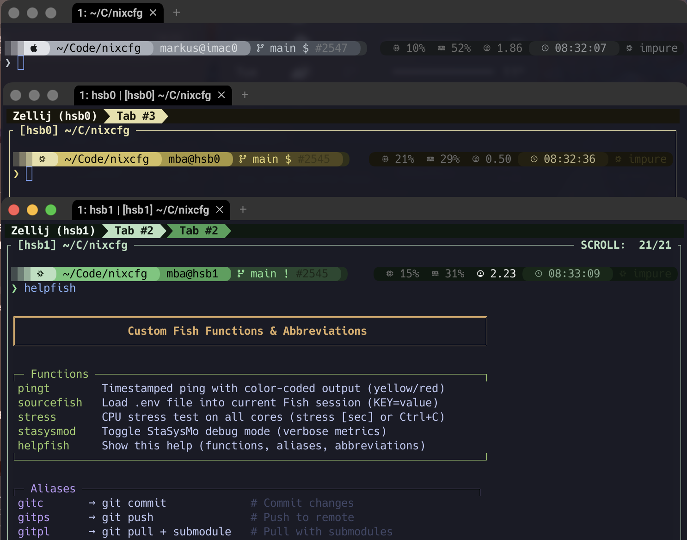

# nixcfg

[GitHub](https://github.com/pbek/nixcfg)

Personal NixOS configuration repository managing 40+ systems with declarative infrastructure, custom packages, and automated deployment workflows.

> **Note**: This repository was originally created by Patrizio Bekerle (pbek). For the original detailed setup instructions and historical content, see [pbek.md](pbek.md).

## Features

- **Modular Architecture**: Custom `hokage` module system for role-based configuration
- **Multi-Platform**: Desktop, laptop, and server configurations
- **Secrets Management**: Declarative encryption with `agenix`
- **Custom Packages**: In-house software (QOwnNotes, NixBit, Ghostty, etc.)
- **ZFS Storage**: Declarative disk management with `disko`
- **Automated Workflows**: Streamlined deployment with `just` commands

## Screenshots

### Shell Environment



## Quick Start

1. **Clone the repository:**

   ```bash
   git clone https://github.com/pbek/nixcfg.git
   cd nixcfg
   ```

2. **Add your host configuration** to `flake.nix` and create `hosts/yourhostname/configuration.nix`

3. **Test your configuration:**

   ```bash
   just check
   ```

4. **Deploy:**
   ```bash
   just switch
   ```

For detailed setup instructions, see [docs/README.md](docs/README.md).

## Secrets Management

This repository uses [agenix](https://github.com/ryantm/agenix) for declarative secret encryption.

### Basic Workflow

```bash
# Encrypt a sensitive file
just encrypt-file hosts/HOSTNAME/filename

# Decrypt an encrypted file
just decrypt-file secrets/filename.age

# Rekey secrets after adding new hosts
just rekey
```

See [docs/overview.md](docs/overview.md) for detailed encryption documentation.

## Installation Methods

### Remote Deployment (Recommended)

Deploy to new machines using [nixos-anywhere](https://github.com/nix-community/nixos-anywhere):

```bash
# Test in VM first
nix run github:nix-community/nixos-anywhere -- --flake .#hostname --vm-test

# Deploy to physical machine
nix run github:nix-community/nixos-anywhere -- --flake .#hostname root@target-ip
```

### Manual Installation

For manual setup with ZFS and encryption:

```bash
# Boot NixOS minimal ISO
# Partition and format disks
sudo nix --experimental-features nix-command --extra-experimental-features flakes \
  run github:nix-community/disko -- --mode disko ./hosts/hostname/disk-config.zfs.nix

# Install system
sudo nixos-install --flake .#hostname
```

See [hosts/hsb0/README.md](hosts/hsb0/README.md) for a complete deployment example.
