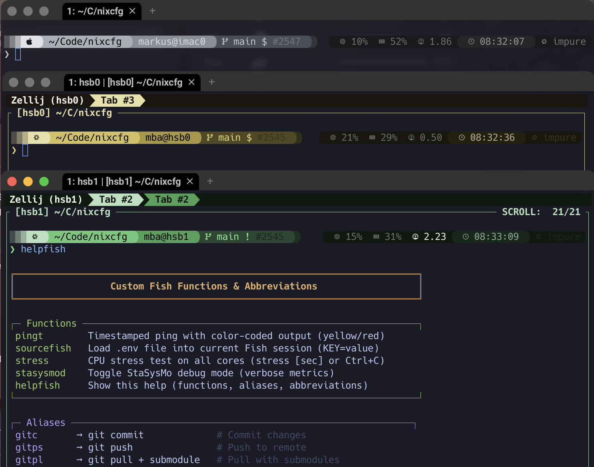

# nixcfg

Personal NixOS configuration managing home servers, cloud infrastructure, and development workstations—all from a single Git repository.

> Built on the excellent [🍥 Hokage module system](https://github.com/pbek/nixcfg) by [Patrizio Bekerle](https://github.com/pbek), extended with custom tooling and Tokyo Night theming.
>
> **Fleet management?** NixFleet has been decommissioned. Its successor, **FleetCom**, is in development (DSC26-52).



## What This Does

**Manages 6 NixOS hosts + 3 macOS workstations:**

| Host              | Role                                      | Location      |
| ----------------- | ----------------------------------------- | ------------- |
| **hsb0**          | DNS/DHCP (AdGuard Home)                   | Home          |
| **hsb1**          | Smart Home Hub (Node-RED, MQTT, HomeKit)  | Home          |
| **hsb8**          | Home Automation                           | Parents' Home |
| **gpc0**          | Gaming Desktop (Steam, Plasma)            | Home          |
| **csb0**          | IoT Hub (MQTT, Telegram Bot)              | Cloud         |
| **csb1**          | Monitoring (Grafana, InfluxDB, Paperless) | Cloud         |
| **imac0**         | Development Workstation                   | macOS (Home)  |
| **mba-mbp-work**  | Work Laptop                               | macOS (Work)  |
| **mba-imac-work** | Work Desktop                              | macOS (Work)  |

**Key Capabilities:**

- 🏗️ **Declarative Everything** — Systems defined in code, reproducible anywhere
- 🔐 **Encrypted Secrets** — Passwords, keys, and tokens secured with [agenix](https://github.com/ryantm/agenix)
- 💾 **ZFS Storage** — Declarative disk layouts with [disko](https://github.com/nix-community/disko)
- 🎨 **Tokyo Night Theme** — Consistent look across all terminals and tools
- 📦 **Custom Packages** — QOwnNotes, NixBit, and other in-house software
- ⚡ **One-Command Deploys** — `just switch` and you're done

## Architecture

```text
┌─────────────────────────────────────────────────────────────────┐
│                    Host Configuration                           │
│              (hsb0, hsb1, gpc0, csb0, etc.)                     │
└──────────────────────────┬──────────────────────────────────────┘
                           │
        ┌──────────────────┼─────────────────────┐
        ▼                  ▼                     ▼
┌───────────────┐  ┌───────────────┐  ┌───────────────────────┐
│  🌀 Uzumaki   │  │ 🤝 common.nix │  │   🍥 External Hokage  │
│  (Personal)   │  │   (Shared)    │  │  github:pbek/nixcfg   │
│               │  │               │  │                       │
│ Fish functions│  │ Overrides &   │  │ Roles, users, core    │
│ Tokyo Night   │  │ customization │  │ programs, ZFS, SSH    │
│ StaSysMo, ... │  │               │  │                       │
└───────────────┘  └───────────────┘  └───────────────────────┘
```

**Hokage** provides the foundation. **Uzumaki** adds the personal touch.

### Architecture Details

The configuration uses different module loading patterns for NixOS and macOS:

<details>
<summary><strong>🐧 NixOS Host Load Order</strong> (hsb0, hsb1, hsb8, gpc0, csb0, csb1)</summary>

```
flake.nix
│
├─▶ commonServerModules (for servers)
│   ├── home-manager.nixosModules.home-manager
│   ├── modules/common.nix ─────────────────────────┐
│   │   ├── Shared fish config (aliases, abbrs)     │
│   │   ├── System packages (git, htop, etc.)       │
│   │   └── home-manager.users.* ───────────────────┼─┐
│   │       └── modules/uzumaki/theme/theme-hm.nix  │ │
│   │           ├── Starship prompt (per-host colors)
│   │           ├── Zellij config (Tokyo Night)     │ │
│   │           └── Eza theme                       │ │
│   ├── nixpkgs.overlays (stable, unstable, local)  │ │
│   └── agenix.nixosModules.age                     │ │
│                                                   │ │
├─▶ inputs.nixcfg.nixosModules.hokage  ◀────────────┘ │
│   └── User mgmt, SSH, ZFS, core programs            │
│                                                     │
└─▶ hosts/<hostname>/configuration.nix                │
    ├── hardware-configuration.nix                    │
    ├── disk-config.zfs.nix                           │
    └── modules/uzumaki (NixOS entry) ◀───────────────┘
        ├── options.nix
        └── stasysmo/nixos.nix
            └── System metrics daemon
```

**File paths loaded for a NixOS server (e.g., hsb1):**

| Path                                       | Purpose                                      |
| ------------------------------------------ | -------------------------------------------- |
| `flake.nix`                                | Entry point, defines inputs and outputs      |
| `modules/common.nix`                       | Shared NixOS config (fish, packages, locale) |
| `modules/uzumaki/default.nix`              | Uzumaki NixOS module                         |
| `modules/uzumaki/options.nix`              | Shared uzumaki options                       |
| `modules/uzumaki/fish/config.nix`          | Fish aliases & abbreviations                 |
| `modules/uzumaki/fish/functions.nix`       | Fish functions (pingt, stress, etc.)         |
| `modules/uzumaki/theme/theme-hm.nix`       | Home Manager theming                         |
| `modules/uzumaki/theme/theme-palettes.nix` | Per-host color palettes                      |
| `modules/uzumaki/stasysmo/nixos.nix`       | System monitoring (systemd)                  |
| `hosts/hsb1/configuration.nix`             | Host-specific services & network             |
| `hosts/hsb1/hardware-configuration.nix`    | Hardware detection                           |
| `hosts/hsb1/disk-config.zfs.nix`           | ZFS pool layout                              |
| `lib/utils.nix`                            | Utility functions                            |

</details>

<details>
<summary><strong>🍎 macOS Host Load Order</strong> (imac0, mba-imac-work, mba-mbp-work)</summary>

```
flake.nix
│
└─▶ mkDarwinHome("<hostname>")
    │
    └─▶ home-manager.lib.homeManagerConfiguration
        ├── pkgs (x86_64-darwin)
        ├── extraSpecialArgs: { inputs, hostname }
        │
        └─▶ hosts/<hostname>/home.nix
            ├── User-level packages (git, jq, zellij, etc.)
            ├── programs.fish (shell config)
            ├── programs.git (dual identity)
            ├── programs.wezterm (terminal)
            │
            └── modules/uzumaki/home-manager.nix
                ├── options.nix
                ├── Fish functions (pingt, stress, etc.)
                ├── Shell aliases & abbreviations
                │
                ├── stasysmo/home-manager.nix
                │   └── System metrics (launchd)
                │
                └── theme/theme-hm.nix
                    ├── Starship prompt (per-host colors)
                    ├── Zellij config (Tokyo Night)
                    ├── Eza theme
                    ├── bat, fzf, lazygit theming
                    └── theme-palettes.nix
```

**File paths loaded for a macOS workstation (e.g., imac0):**

| Path                                           | Purpose                                |
| ---------------------------------------------- | -------------------------------------- |
| `flake.nix`                                    | Entry point with `mkDarwinHome` helper |
| `hosts/imac0/home.nix`                         | User config (packages, shell, git)     |
| `hosts/imac0/config/karabiner.json`            | Keyboard remapping                     |
| `modules/uzumaki/home-manager.nix`             | Uzumaki HM module                      |
| `modules/uzumaki/options.nix`                  | Shared uzumaki options                 |
| `modules/uzumaki/fish/config.nix`              | Fish aliases & abbreviations           |
| `modules/uzumaki/fish/functions.nix`           | Fish functions                         |
| `modules/uzumaki/theme/theme-hm.nix`           | Per-host theming                       |
| `modules/uzumaki/theme/theme-palettes.nix`     | Color palette definitions              |
| `modules/uzumaki/theme/starship-template.toml` | Starship config template               |
| `modules/uzumaki/theme/eza-themes/sysop.yml`   | Eza color theme                        |
| `modules/uzumaki/stasysmo/home-manager.nix`    | System monitoring (launchd)            |
| `lib/utils.nix`                                | Utility functions                      |

</details>

<details>
<summary><strong>🎨 Module Responsibilities</strong></summary>

| Module                         | NixOS | macOS | Purpose                                            |
| ------------------------------ | :---: | :---: | -------------------------------------------------- |
| **hokage** (external)          |  ✅   |  ❌   | User management, SSH keys, ZFS, core packages      |
| **common.nix**                 |  ✅   |  ❌   | Fish config, locale, system packages, nix settings |
| **uzumaki/default.nix**        |  ✅   |  ❌   | NixOS fish functions, stasysmo daemon              |
| **uzumaki/home-manager.nix**   |  ❌   |  ✅   | macOS fish functions, theming, launchd             |
| **uzumaki/theme/theme-hm.nix** |  ✅   |  ✅   | Starship, zellij, eza per-host colors              |
| **uzumaki/stasysmo/**          |  ✅   |  ✅   | System metrics in prompt (systemd/launchd)         |
| **uzumaki/fish/**              |  ✅   |  ✅   | Shared aliases, abbreviations, functions           |

</details>

## Quick Start

```bash
# Clone
git clone https://github.com/markus-barta/nixcfg.git && cd nixcfg

# Validate configuration
just check

# Deploy to current machine
just switch

# Deploy to remote host
just hsb1-switch
```

## Essential Commands

| Command         | Description                     |
| --------------- | ------------------------------- |
| `just check`    | Validate all configurations     |
| `just switch`   | Build and deploy locally        |
| `just upgrade`  | Update flake inputs and rebuild |
| `just rollback` | Revert to previous generation   |
| `just cleanup`  | Free disk space                 |

**Secrets:**

```bash
just encrypt-file hosts/HOSTNAME/secret.txt  # Encrypt
just decrypt-file secrets/secret.age         # Decrypt
just rekey                                   # Rekey after adding hosts
```

## Documentation

- **[How It Works](docs/how-it-works.md)** — Architecture overview, module system explained
- **[Hokage Options](docs/hokage-options.md)** — Complete configuration reference
- **[Host READMEs](hosts/)** — Per-host documentation and runbooks

## Repository Structure

```
nixcfg/
├── flake.nix              # Entry point, all host definitions
├── hosts/                 # Per-machine configurations
│   ├── hsb0/             # DNS/DHCP server
│   ├── hsb1/             # Smart home hub
│   ├── gpc0/             # Gaming desktop
│   └── ...
├── modules/
│   ├── common.nix        # Shared NixOS config
│   └── uzumaki/          # Personal tooling & theming
├── pkgs/                  # Custom packages
├── secrets/               # Encrypted secrets (.age files)
└── docs/                  # Documentation
```

## Why NixOS?

- **Reproducibility** — Same config = same system, every time
- **Atomic Updates** — Changes apply completely or not at all
- **Rollbacks** — Boot any previous generation from the menu
- **Infrastructure as Code** — Your config _is_ the documentation

---

_One repo to rule them all, one flake to find them, one switch to bring them all, and in the Nix store bind them._ 💍
test
